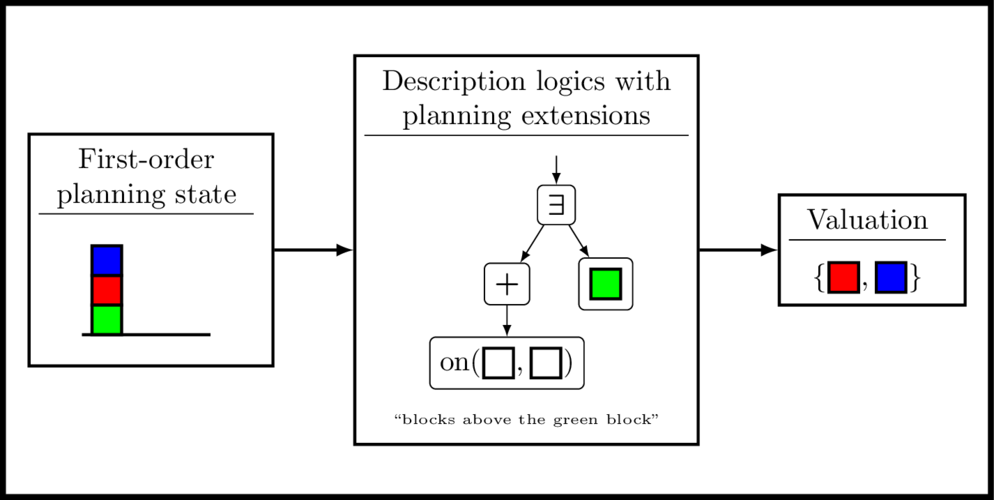

# Description Logics State Features for Planning Library (DLPlan)

Welcome to the DLPlan-library.


*Figure 1: illustration of the core functionality of DLPlan - evaluating a domain-general state feature based on description logics with planning extensions on a given first-order planning state.*

## 1. Background

### 1.1. State Language

We consider a set of predicates where each predicate has the form p\n where p is a name and n is the number of arguments coming from a set of objects. A unary predicate takes exactly one argument and a binary predicates takes exactly two arguments. An atom is a predicate p where each argument takes one of the objects. A state is a set of atoms.

### 1.2. Classical Planning

We consider a set of classical planning instances Q = {P_1, P_2, ..., P_n} where each P in Q consists of a set of states over a common state language.

### 1.3. Description Logics

There are two types of objects in description logics: concepts and roles. A Concept C is an additional unary predicate C\1 a role R is an additional binary predicate R\2. There are several base grammar rules and inductive grammar rules in description logics. Their interpretation on the states yield sets of atoms over the unary (resp. binary) predicates. Counting the number of ground atoms yield the valuation for a numerical feature n : S -> {0,1,...} or checking whether there exists a least one ground atoms yields a Boolean feature b : S -> {0,1}. Since we assume a common state language for all planning instances in Q, we can evaluate the features on any given state from any planning instane P in Q.

## 2. Features of the DLPlan-library

The library consists of five components. Each component has its own public header file, examples, tests, and python bindings.

### 2.1. Core

The core component provides functionality for the construction an evaluation of domain-general state features based on description logics.

### 2.2. Generator

The generator component provides functionality for automatically generating a set of domain-general state features that are distinguishable on a given finite set of states.

### 2.3. Policy

The policy component implements the general policy language.

### 2.4. State Space

The state space provides functionality for generating state spaces from PDDL.

### 2.5. Novelty

The novelty component provides functionality for width-based planning and learning.

### 3.1. Building the C++ Interface

Install requirements
```console
pip install pybind11 pybind11-global state_space_generator
```

Run the following from the project root to build the library.
By default, the library compiles in `Debug` mode.

```console
cmake -S . -B build
cmake --build build -j4
```
To build the library in `Release` mode, run
```console
cmake -DCMAKE_BUILD_TYPE=Release -S . -B build
cmake --build build -j4
```
To install the library, run
```console
cmake --install build
```

### 3.2. Additional Compile Flags

- DENABLE_TESTING:BOOL=TRUE enables compilation of tests

### 3.3. Building the Python Interface

```console
python3 -m venv --prompt dlplan .venv
source .venv/bin/activate
pip install -r requirements.txt
pip install dlplan
```

## 4. Running the Examples

The subdirectory `examples/` contains a number of helpful examples that illustrate different use cases of this library.

You can run the C++ examples with
```console
./build/examples/core/core_example
./build/examples/generator/generator_example
```
The Python bindings also come with the same examples. Run them with
```console
python3 examples/core/core.py
python3 examples/generator/generator.py
```

## 5. Running the Tests

You can run the C++ tests with:
```console
cd build && ctest
```

The Python bindings also come with their own set of tests. Run them with
```console
python3 -m pytest api/python/
```

## 6. Profiling

In the `experiments/` directory, we provide code to profile parts of the library. To run the experimental code, it is necessary to install the modified version of `tarski` that we provide in the respective submodule in the `submodules/tarski` directory.

## 7. Citing DLPlan

We created a DOI on zenodo under this [link](https://zenodo.org/record/5826140#.YfK9E_so85k). A bibtex entry can look like this:

```
@software{drexler-et-al-dlplan2022,
author = {Drexler, Dominik and
Francès, Guillem and
Seipp, Jendrik},
title = {{DLPlan}},
year = 2022,
publisher = {Zenodo},
doi = {10.5281/zenodo.5826139},
url = {https://doi.org/10.5281/zenodo.5826139}
}
```

## 8. Publications List

- Learning and Exploiting Progress States in Greedy Best-First Search, Patrick Ferber, Liat Cohen, Jendrik Seipp, and Thomas Keller, International Joint Conference on Artificial Intelligence, 2022, Vienna, Austria
- Learning Sketches for Decomposing Planning Problems into Subproblems of Bounded Width, Dominik Drexler, Jendrik Seipp, and Hector Geffner, International Conference on Automated Planning and Scheduling, 2022, Singapore, Singapore
